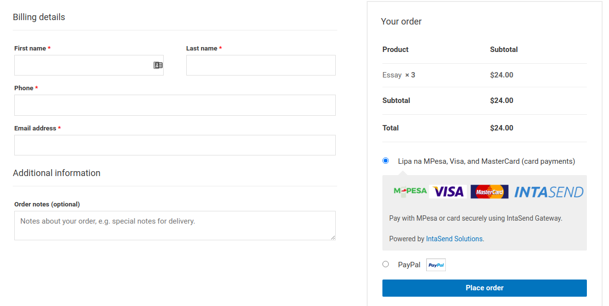

# Intasend Payment Gateway Integration

Get paid with mobile and card payments (Visa and Mastercard). Automatically help customers to complete payment at checkout. Customer securely pay for your goods and services and you are able to track and monitor every transaction

## How it works

1. Add the plugin "IntaSend Payment for Woocomerce" to your site.
2. Signup to https://intasend.com to get generate API keys.
3. Publish and accepting Card and Mobile payments collecting.

### How do it test before live publishing?

Generate test keys from the sandbox - https://sandbox.intasend.com/account/api-keys/ and configure the plugin to be on test mode. Use the following test cards for your test - https://developers.intasend.com/sandbox-and-live-environments#test-card-numbers

## How much does it cost to use IntaSend?

Please check our pricing here - https://intasend.com/collect-payments/

## How do I get support?

Feel free to contact us through support@intasend.com and developers@intasend.com for both transaction queries and developers support respectively.

## Screenshots

